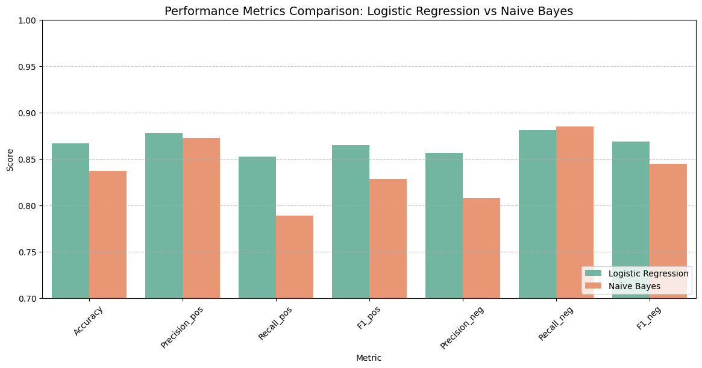
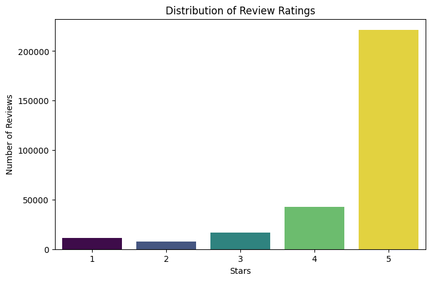
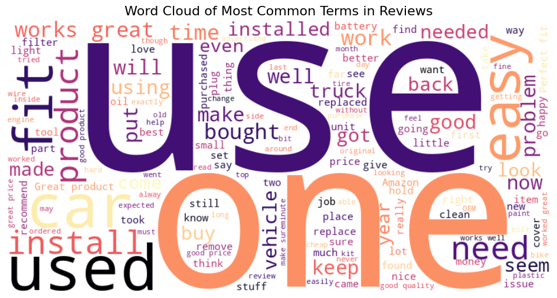
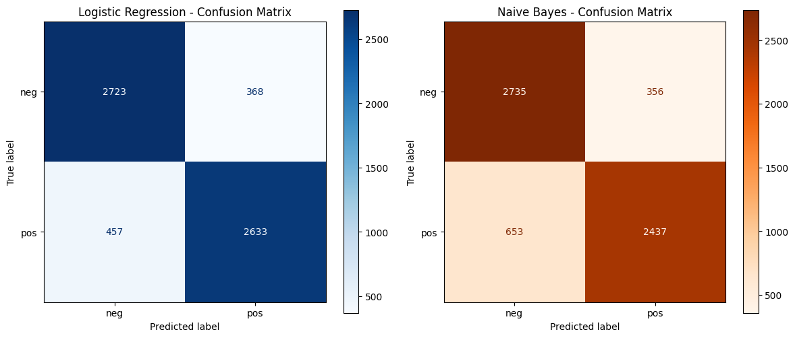
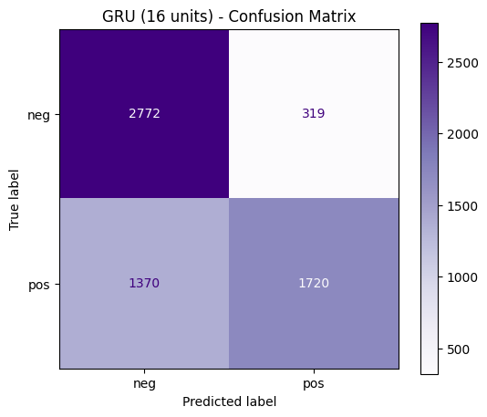

# Opinion Mining on Amazon Reviews
### Traditional ML vs. Deep Learning vs. LLM Zero-Shot Prompting for Sentiment Classification

A text mining project comparing four fundamentally different approaches to sentiment
classification — TF-IDF + classical ML, a GRU neural network with pretrained GloVe
embeddings, and zero-shot prompting with a small open-source LLM — on 300K Amazon
Automotive product reviews, with statistical significance testing between models.



## Overview

Given a large corpus of raw Amazon reviews, the goal is to build and rigorously
compare sentiment classifiers of increasing complexity: a bag-of-words baseline, a
sequence-aware deep learning model, and a modern generative LLM used with no
task-specific training at all. Beyond accuracy, McNemar's test is used to check
whether the observed differences between models are statistically significant
rather than due to chance.

## Data

300,000 Amazon Automotive category reviews (`reviewText`, `overall` star rating).
3-star (neutral) reviews are dropped, the remaining 1–2 vs. 4–5 star reviews are
mapped to binary `neg` / `pos` labels, and the dataset is undersampled to be
perfectly class-balanced (15,452 reviews per class) before splitting into
train / validation / test sets.




## Methodology

1. **EDA** — rating distribution, review length statistics, and a word cloud of the
   most frequent terms.
2. **Preprocessing** — dropped neutral reviews, undersampled for class balance,
   built a binary `pos`/`neg` label.
3. **Feature extraction** — TF-IDF vectorization (with bigrams) for the classical ML
   models.
4. **Classical ML** — Logistic Regression and Multinomial Naive Bayes, both tuned via
   `GridSearchCV` with a predefined train/validation split.
5. **Deep learning** — a GRU recurrent network initialized with pretrained GloVe word
   embeddings, tuned over hidden-unit size (16 / 32 / 64) with early stopping.
6. **LLM zero-shot prompting** — `Qwen1.5-0.5B-Chat` prompted directly (no
   fine-tuning) to classify a 100-review subset, to test how a general-purpose
   generative model compares to task-specific models out of the box.
7. **Statistical validation** — McNemar's test on paired predictions to check whether
   performance differences between models are statistically significant.

## Results

### Test-set performance (6,181 held-out reviews)

| Model | Test Accuracy | Notes |
|---|---|---|
| **Logistic Regression** | **0.867** | Best overall model; `C=1` |
| Multinomial Naive Bayes | 0.837 | `alpha=1.0`; fast, solid baseline |
| GRU + GloVe embeddings | 0.727 | Best config: 16 hidden units |



Logistic Regression outperforms Naive Bayes on every metric — consistent with Naive
Bayes' independence assumption being a poor fit for natural language, where word
co-occurrence (e.g. "not" + "good") carries real signal that Logistic Regression can
learn but Naive Bayes cannot.

The GRU, despite using pretrained GloVe embeddings, underperforms both classical
TF-IDF models on this task. Larger hidden-unit configurations (32, 64) were
noticeably less stable during training than the 16-unit model — a sign that this
dataset/task may not have enough sequential complexity to reward a heavier
recurrent architecture over a bag-of-words approach.



### LLM zero-shot prompting (100-review subset)

| Model (same 100-sample subset) | Accuracy |
|---|---|
| Logistic Regression | 0.840 |
| GRU | 0.690 |
| **LLM zero-shot (Qwen1.5-0.5B-Chat)** | **0.470** |

On this dataset, zero-shot prompting with a small open-source LLM performed
substantially **worse** than both the classical and deep learning models — well
below even a random-guess baseline on the positive class (recall of 0.04 for `pos`).
This is a useful negative result: a small, general-purpose LLM used with no
task-specific tuning is not automatically competitive with a properly-tuned
TF-IDF + Logistic Regression baseline, at least at this model scale and with a
simple zero-shot prompt.

### Statistical significance (McNemar's test)

| Comparison | p-value | Significant? |
|---|---|---|
| Logistic Regression vs. Naive Bayes | 7.5 × 10⁻¹⁴ | Yes |
| Logistic Regression vs. GRU | 3.9 × 10⁻¹¹⁸ | Yes |
| Naive Bayes vs. GRU | 1.6 × 10⁻⁸⁰ | Yes |

All pairwise differences in model predictions are highly statistically significant
— the accuracy gaps above are not due to chance.

## Key takeaway

More complex ≠ better, at least not automatically. The simplest model in this
comparison — TF-IDF + Logistic Regression — was also the most accurate, beating both
a GRU with pretrained embeddings and zero-shot LLM prompting. Deep learning and LLM
approaches bring real advantages (capturing sequence context, requiring no
task-specific training data) but they aren't a free upgrade over a well-tuned
classical baseline, and this project's results are a concrete illustration of why
that baseline is always worth building first.

## Repository structure

```
.
├── notebook.ipynb   # Full pipeline: EDA → preprocessing → TF-IDF → classical ML →
│                     # GRU + GloVe → LLM zero-shot → McNemar significance tests
├── rating_distribution.png
├── review_length_distribution.png
├── wordcloud.png
├── balanced_class_distribution.png
├── confusion_matrices.png
├── model_metrics_comparison.png
└── gru_training_curves.png
```

## Tech stack

`pandas` · `scikit-learn` (TF-IDF, Logistic Regression, Naive Bayes, GridSearchCV) ·
`TensorFlow / Keras` (GRU) · `GloVe` embeddings · `transformers` (Qwen1.5-0.5B-Chat) ·
`statsmodels` (McNemar's test) · `Matplotlib` / `Seaborn` / `WordCloud`

## How to run

1. The notebook downloads its own dataset (`Automotive_5.json.gz`) at the start.
2. Run all cells top to bottom. TF-IDF and classical ML models train in under a
   minute; the GRU hyperparameter sweep and LLM prompting step take longer
   (GPU recommended for the GRU and LLM sections).

## Course context

Text Mining team project (Team 1) — Data Science & Business Analytics, Bologna
Business School (2026).
